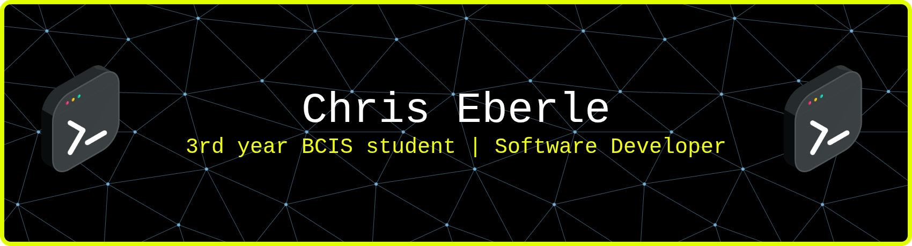

<!-- Banner container -->

  

  <!-- LinkedIn badge overlapping the banner -->
  

    
  

  

    

    

    

  

  <pre style="white-space: pre-wrap; margin: 0; font-size: 14px;">
ChrisEberleSchool@github:~$ whoami
▪ I'm a 3rd-year Computer Information Systems student in Calgary
▪ Passionate about web development, cloud infrastructure, and full-stack projects
▪ I love building self-hosted web/server setups and automating workflows

ChrisEberleSchool@github:~$ echo "Currently Working On"
▪ Lampen-IT
    - Fully self-hosted web/server infrastructure with thorough
      documentation to enable people to replicate and self-host their
      own production environments.
▪ Windi-Bot
    - Software for an autonomous window opening, temperature
      management robot.

ChrisEberleSchool@github:~$ echo "Aspirations"
▪ Become a professional Full-Stack Software Developer
▪ Contribute to open-source projects
▪ Eventually create self-hosted SaaS solutions for small businesses
  </pre>

### Employer?

> [!IMPORTANT]  
> 

---

#### Skills

  

  

  

  

---